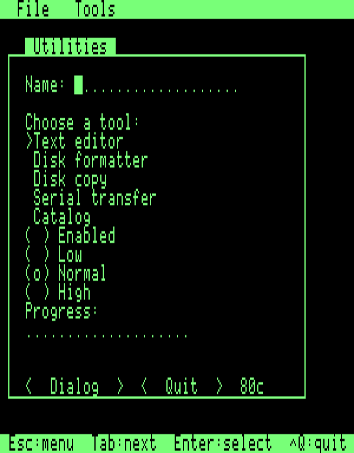
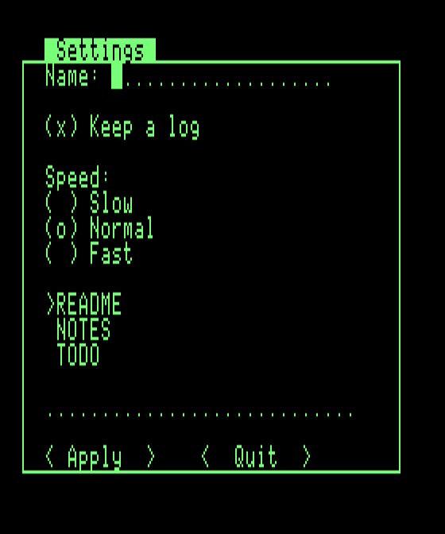

# a2tui : guide d'utilisation et notes techniques

[English version](usage.en.md) · [README](../README.md)

Bibliothèque C (cc65) d'interface texte façon Turbo Vision pour Apple II.
**Minimum : Apple //e ou //c, 64 Ko** (ni II ni II+). 40 ou 80 colonnes,
détectées au démarrage.



## Compilation et premier programme

```
make            # build/a2tui.lib
make dsk        # build/tuidemo.dsk : disquette ProDOS bootable avec la démo
make edit-dsk   # build/edit.dsk : l'éditeur de texte (`apps/edit`), voir plus bas
```

Prérequis : cc65, Java et AppleCommander (voir `tools/ac/README.md`). `prodos/` contient la disquette modèle (ProDOS 2.4.2, logiciel libre) et le loader repris de a2adv.

Une application :

```c
#include "a2tui.h"

static TWindow win;  static TLabel lbl;  static TButton ok;

int main(void) {
    app_init();
    window_init(&win, 2, 2, 30, 8, "Hello", 0);
    label_init(&lbl, 2, 2, 0, "Bonjour Apple II");
    button_init(&ok, 2, 5, 10, "Quit", CM_QUIT);
    window_add(&win, &lbl.v);  window_add(&win, &ok.v);
    app_insert(&win.g.v);
    app_run();
    app_done();
    return 0;
}
```

Tout est statique (pas de `malloc`) : la structure est déclarée par l'appelant,
`*_init()` la remplit. Voir `demo/demo.c` pour un exemple complet.

## Construire une fenêtre

Une fenêtre est un conteneur (`TWindow`) auquel on ajoute des widgets. Tout est
déclaré en `static` par l'application ; chaque `*_init()` remplit la structure,
`window_add()` l'ajoute à la fenêtre et `app_insert()` place la fenêtre sur le
bureau.

1. **Déclarer** la fenêtre et ses widgets.
2. **Initialiser** : `window_init(&win, x, y, largeur, hauteur, titre, 0)`, puis
   un `*_init()` par widget.
3. **Ajouter** chaque widget avec `window_add(&win, &widget.v)` : l'ordre
   d'ajout est l'ordre de focus (Tab passe au suivant).
4. **Insérer** la fenêtre avec `app_insert(&win.g.v)`.
5. **Réagir** : un bouton émet la commande qu'on lui a donnée ; on la traite
   dans une fonction branchée par `app_set_handler()`.

Coordonnées : celles de la fenêtre sont relatives au bureau (juste sous la
barre de menu), celles des widgets au coin haut-gauche du cadre de la fenêtre
(donc ≥ 1). La largeur et la hauteur de la fenêtre comprennent le cadre.



```c
#include "a2tui.h"

#define CM_APPLY (CM_USER + 0)

static const char *const speeds[] = { "Slow", "Normal", "Fast" };
static const char *const files[]  = { "README", "NOTES", "TODO" };

static TWindow     win;
static TLabel      lbl_name, lbl_speed, lbl_status;
static TInputLine  in_name;
static char        name[17];
static TCheckBox   chk_log;
static TRadioGroup radio;
static TListBox    list;
static TProgress   bar;
static TButton     btn_apply, btn_quit;

static u8 on_command(TEvent *ev)
{
    if (ev->cmd == CM_APPLY) {
        progress_set(&bar, (u16)(radio.sel + 1));
        label_set(&lbl_status, chk_log.checked ? "Log on" : "Log off");
        return EVENT_HANDLED;
    }
    return EVENT_NOT_HANDLED;
}

int main(void)
{
    app_init();

    window_init(&win, 2, 1, 34, 18, "Settings", 0);
    label_init(&lbl_name, 2, 1, 0, "Name:");
    input_init(&in_name, 8, 1, 20, name, 16);
    checkbox_init(&chk_log, 2, 3, "Keep a log", 1);
    label_init(&lbl_speed, 2, 5, 0, "Speed:");
    radiogroup_init(&radio, 2, 6, 20, speeds, 3, 1);
    list_init(&list, 2, 10, 28, 3, list_strings_get, (void *)files, 3, CM_NONE);
    progress_init(&bar, 2, 14, 28, 3);
    label_init(&lbl_status, 2, 15, 28, "");
    button_init(&btn_apply, 2, 16, 10, "Apply", CM_APPLY);
    button_init(&btn_quit, 16, 16, 10, "Quit", CM_QUIT);

    window_add(&win, &lbl_name.v);
    window_add(&win, &in_name.v);
    window_add(&win, &chk_log.v);
    window_add(&win, &lbl_speed.v);
    window_add(&win, &radio.v);
    window_add(&win, &list.v);
    window_add(&win, &bar.v);
    window_add(&win, &lbl_status.v);
    window_add(&win, &btn_apply.v);
    window_add(&win, &btn_quit.v);
    app_insert(&win.g.v);

    app_set_handler(on_command);
    app_run();
    app_done();
    return 0;
}
```

| Widget | Création | À lire ou à modifier |
| --- | --- | --- |
| `TLabel` | `label_init(&l, x, y, largeur, "texte")` (largeur 0 = celle du texte) | `label_set(&l, "autre")` |
| `TInputLine` | `input_init(&in, x, y, largeur, tampon, max)` (tampon de `max + 1` octets) | `in.buf`, `input_set_text(&in, "...")` |
| `TCheckBox` | `checkbox_init(&c, x, y, "texte", coche)` | `c.checked` |
| `TRadioGroup` | `radiogroup_init(&r, x, y, largeur, libelles, n, choix)` | `r.sel`, `radiogroup_select()` |
| `TListBox` | `list_init(&l, x, y, largeur, hauteur, get, ctx, n, cmd)` (`cmd` : émise sur Entrée) | `l.sel`, `list_set_count()`, `list_select()` |
| `TProgress` | `progress_init(&p, x, y, largeur, max)` | `progress_set(&p, valeur)` |
| `TButton` | `button_init(&b, x, y, largeur, "texte", cmd)` | |

Pour une liste, `list_strings_get` lit un tableau de chaînes ; pour d'autres
données, on fournit sa propre fonction `get(ctx, index)` qui renvoie le texte de
la ligne.

**Les commandes.** Les commandes de l'application commencent à `CM_USER`.
Le gestionnaire reçoit celles que personne n'a consommées et renvoie
`EVENT_HANDLED` pour les arrêter. Il ne faut pas renvoyer `EVENT_HANDLED` pour
`CM_QUIT` sans raison : c'est elle qui termine `app_run()`.

**Un dialogue modal** s'ouvre par-dessus et bloque jusqu'à sa fermeture. Deux
façons de le construire :

```c
/* 1. Une fenêtre WF_MODAL, construite comme ci-dessus, exécutée par app_exec() */
window_init(&dlg, 0, 0, 30, 8, "Rename", WF_MODAL);
window_center(&dlg);
/* ... widgets, puis : */
window_set_default(&dlg, CM_OK);      /* commande émise par Entrée */
if (app_exec(&dlg) == CM_OK) { /* validé */ }

/* 2. Une table de description (un seul jeu de widgets partagé par tous les dialogues) */
static char buf[17];
static const TDlgItem items[] = {
    { DI_LABEL,  2, 1,  0, "New name:", 0 },
    { DI_INPUT,  2, 2, 16, buf, 16 },
    { DI_BUTTON, 2, 4,  8, "OK", CM_OK },
    { DI_BUTTON, 14, 4, 10, "Cancel", CM_CANCEL },
};
dialog_build("Rename", 28, 7, items, 4, CM_OK);
input_set_text(&dlg_item[1].input, "old name");   /* après dialog_build() */
if (dialog_run() == CM_OK) { /* buf contient la saisie */ }

/* Boîte de message toute prête */
if (msgbox("Quit", "Really quit?", MB_YESNO) == CM_YES) { /* ... */ }
```

À savoir :
- un groupe contient au plus `TUI_MAX_CHILDREN` (12) widgets ;
- les structures doivent vivre aussi longtemps que la fenêtre (`static`, pas de
  variable locale) ;
- les dialogues construits par table et `msgbox` partagent le même jeu de
  widgets : un seul est ouvert à la fois ;
- `demo/demo.c` montre le même principe avec une barre de menu et un dialogue.

## Semi-graphique (MouseText)

`#define TUI_MOUSETEXT 1` (défaut, dans `tui_config.h` ou `-DTUI_MOUSETEXT=0`) :
les cadres, séparateurs de menu et glyphes (`G_UP`, `G_DOWN`, `G_CHECK`,
`G_TRACK`…, voir `screen.h`) sortent en MouseText sur //e enhanced, carte //e
et //c (détecté par `get_ostype()`). Sur un //e d'origine, ou en vidéo
inverse, ils retombent tout seuls sur de l'ASCII (`+ - |`). À 0, le code et
les tables MouseText ne sont pas compilés.

Le MouseText n'a pas de glyphes de coin : la bordure haute est le `_` (trait
en bas de cellule), la basse le glyphe `$4C` (trait en haut), et les barres
`$5F`/`$5A` les rejoignent. Contrepartie : la bibliothèque utilise toujours le
jeu de caractères **alternatif**, qui n'a pas de vidéo *flash* (le curseur de
saisie est donc une cellule inversée fixe) mais offre l'inverse minuscule.

## Souris

`#define TUI_MOUSE 1` (défaut ; `-DTUI_MOUSE=0` pour un binaire sans souris,
2,8 Ko de moins sur la démo). Driver standard de cc65 (`a2.stdmou` : carte souris
Apple II en slot, port souris intégré du //c), lié statiquement ; si aucune
souris n'est détectée, la bibliothèque fonctionne au clavier sans rien changer.
`mouse_present()` dit ce qu'il en est.

- Pointeur : flèche MouseText (cellule inversée sans MouseText), superposée à
  l'écran à chaque flush sans toucher au tampon virtuel.
- Clics (bouton gauche) : focus + action sur bouton, champ de saisie (place le
  curseur), liste (sélection ; second clic = validation), barre de menu (titre,
  article ; survol de la barre déroulante, clic ailleurs = fermeture).
  Dans un dialogue modal, ce qui est hors du dialogue est inerte.
- Événements : `EV_MOUSE_DOWN/UP/MOVE` avec `mouse_x/mouse_y` en cellules texte.

## Architecture

| Couche | Fichiers | Rôle |
| --- | --- | --- |
| Rendu | `screen.c` | tampon virtuel + shadow, lignes sales, flush différentiel. Une cellule = 1 octet = code écran Apple II (attribut inclus). Seul module qui connaît la mémoire vidéo. |
| Événements | `keyboard.c`, `mouse.c`, `event.c` | `event_poll()` → `TEvent` unique (clavier d'abord, puis souris). |
| Views | `tview.c`, `widgets.c`, `window.c`, `menu.c` | `TView`/`TGroup`, dessin par vue sale, focus, bubbling. |
| Dialogues | `dialog.c`, `filesel.c`, `busy.c` | dialogues décrits par tables, `msgbox`, sélecteur de fichier/dossier, indicateur d'attente. |
| Application | `app.c` | bureau, barre de menu (ligne 0), barre d'état (ligne 23), boucle, `app_exec()` modal. |

Contrat d'événement : `handle()` renvoie `EVENT_HANDLED` ou `EVENT_NOT_HANDLED`.
Un widget qui émet une commande **réécrit** l'événement en `EV_COMMAND` et
renvoie `NOT_HANDLED` : la commande remonte de parent en parent jusqu'à un
dialogue modal, puis au handler applicatif (`app_set_handler`).

Clavier : Tab/Bas/Droite = focus suivant, Haut/Gauche = précédent (si le widget
ne prend pas la touche), Échap = ouvre le menu (ou annule un dialogue),
Entrée = bouton par défaut. Raccourcis de menu : Ctrl-lettre (hors
`^H ^I ^J ^K ^M ^U ^[` qui sont les flèches/Tab/Entrée/Échap).

## Granularité du lien

Chaque widget (`label.c`, `button.c`, `input.c`, `list.c`, `checkbox.c`),
`dialog.c` et `menu.c` sont des fichiers séparés : `ld65` ne lie que les
modules réellement référencés, donc une appli qui n'utilise ni liste, ni
menu, ni dialogue ne paie pas leur code. Vérifié en liant un binaire de test
n'utilisant que fenêtre/label/bouton : `menu.o`, `list.o`, `input.o`,
`dialog.o` et `checkbox.o` en sont absents.

Un piège à connaître si vous ajoutez un module : le lieur élague au niveau du
**fichier objet entier**, pas par fonction. Si `app.c` appelait
`menubar_run()` par son nom, ne serait-ce que dans une branche jamais prise à
l'exécution, `menu.o` serait lié dans tous les cas — le test `if (menubar)`
est une décision d'EXÉCUTION, pas une absence de référence à la
COMPILATION. C'est pour ça qu'`app.c` ne connaît de `menu.c` que le type
`TMenuHooks` (menu.h) : `menubar_init()` s'enregistre lui-même auprès
d'`app.c` via `app_set_menu_hooks()`, ce qui reporte tout le couplage vers
l'appelant (qui, s'il veut un menu, lie déjà `menu.o` pour cette raison).

## Choix de conception

- `TView` porte un pointeur vers une **table `const TViewOps` partagée** plutôt
  que deux pointeurs de fonction par instance (−2 octets/vue, même effet).
- Cellule d'écran = **un octet** (code écran, attribut inclus) : tampon
  80×24 = 1920 o. Attributs : normal / inverse (le « flash » est rendu en inverse).
- `TEvent` : coordonnées souris en `u8` (écran 80×24), champ `cmd` ajouté.
- Focus **par groupe** (pas de pointeur global) ; la liste focalisable est
  parcourue au moment du Tab (≤ 12 enfants).
- **Save-under partiel** : les menus déroulants sauvegardent/restaurent leur
  rectangle depuis le tampon virtuel (gratuit, 400 o max). Les dialogues restent
  en redessin complet du bureau, (v1).
- Largeur détectée à l'**exécution** (`scr_cols`), tampons dimensionnés par
  `TUI_SCR_MAXCOLS` (compiler en 40 pour économiser environ 1 Ko).
- Pas de `-Cl` : les groupes s'imbriquent (bureau → fenêtre), le dessin et le
  dispatch sont ré-entrants.

## Mesures (cc65 2.19, `-O -Os`)

Bibliothèque complète (tous les modules liés) : 17 958 octets de code, 200 de
constantes, 3 709 de variables, et 3 064 en carte langage (`LC`). Une
application ne lie que les modules qu'elle utilise.

## Limites connues (v1)

- Pas de Shift-Tab (indistinguable sur Apple II) : Haut/Gauche font le retour.
- Pas de II/II+ (minuscules, MouseText et jeu alternatif supposés).
- Pas de curseur clignotant (jeu alternatif : pas de flash).
- Souris : bouton gauche seul, pas de double-clic ni de glisser. Pas de double
  buffering page 2. La bibliothèque n'utilise pas la RAM auxiliaire (hors affichage
  80 colonnes) ; l'éditeur, lui, s'en sert pour son tampon de texte.
- `TUI_MAX_CHILDREN` = 12 par groupe ; une seule `msgbox`/dialogue à la fois
  (`busy_show()` de `busy.h` partage aussi ce singleton : ne pas l'appeler
  pendant qu'un autre dialogue est ouvert).


## Sélecteur de fichier et de dossier (`filesel.h`)

Un seul dialogue pour ouvrir un fichier, enregistrer sous un nouveau nom ou
choisir un dossier. Il navigue dans les répertoires ProDOS (sur PC : POSIX),
ne change jamais le répertoire courant du programme et renvoie le
chemin complet. La bibliothèque ne contient aucun texte visible : tous les
libellés viennent de l'appelant.

```c
static const TFileSelText txt = {
    "Name:", "OK", "Cancel", "New",
    "File exists.\nOverwrite it?",     /* FS_SAVE : confirmation d'écrasement */
    "Cannot create\nthe folder",       /* échec de création (FS_FOLDER) */
};

char path[FS_PATH_LEN] = "";           /* "" = répertoire courant, ou un chemin proposé */
if (filesel(FS_OPEN, "Open", &txt, path) == CM_OK)
    use(path);                         /* ex. "/VOL/DIR/FICHIER" */
```

| Mode | Comportement |
| --- | --- |
| `FS_OPEN` | choisir un fichier existant (Entrée sur un fichier de la liste le valide) |
| `FS_SAVE` | choisir ou saisir un nom ; demande confirmation avant d'écraser |
| `FS_FOLDER` | liste des dossiers seulement ; « OK » renvoie le dossier affiché, « New » crée le dossier dont le nom est saisi et y entre |

Les noms sont mis en majuscules (règle ProDOS) sur l'Apple II ; la liste
affiche 32 entrées au plus, noms de 15 caractères. Les répertoires ProDOS sont lus par morceaux de 39
octets : aucun tampon de bloc n'est réservé.

## Éditeur de texte (`apps/edit`)

Éditeur dans l'esprit de MS-DOS EDIT, bâti sur la bibliothèque : menus
File / Edit / Search / Help, sélection, presse-papiers, recherche, remplacement,
« aller à la ligne », dialogues Open / Save As avec navigation dans les
répertoires ProDOS, souris (clic, glisser pour sélectionner). Les fichiers sont
des fichiers texte ProDOS (type `TXT`, fin de ligne CR ; les fichiers LF / CRLF
et le bit 7 sont normalisés à la lecture).

```
make edit-dsk                # build/edit.dsk (ProDOS bootable, avec README.TXT)
make edit-dsk TUI_MOUSE=0    # sans souris : 3 Ko de texte en plus
```

**Clavier** (l'Apple II n'a ni Shift+flèche, ni Home/Fin, ni Page) :

| Touches | Action |
| --- | --- |
| flèches | déplacement |
| Pomme fermée + déplacement | étend la sélection |
| Pomme ouverte + ← → / ↑ ↓ | mot précédent/suivant / page |
| `^A` `^E` / `^T` `^B` | début/fin de ligne / début/fin du texte |
| Suppr (`$7F`) / `^D` | efface à gauche / à droite |
| `^X` `^C` `^V` `^L` `^Y` | couper, copier, coller, tout sélectionner, effacer la ligne |
| `^F` `^G` `^R` `^W` | chercher, suivant, remplacer, aller à la ligne |
| `^N` `^O` `^S` `^Q` | nouveau, ouvrir, enregistrer, quitter |
| Échap | barre de menu ; dans un menu, taper l'initiale d'un article le lance |

**Contraintes de la machine** (mesurées, cc65 2.19) :

- **RAM auxiliaire.** Sur un //c, ou un //e avec une carte 80 colonnes étendue
  (128 Ko, que ProDOS signale dans `MACHID`), le tampon de texte (gap buffer)
  est placé en RAM auxiliaire (`$0800`–`$BFFF`) : **47 104 octets**, sans
  conséquence sur la RAM principale. Une copie de 113 octets en `$0300` des
  deux banques (`auxrt.s`) fait les transferts, et une fenêtre de 256 octets en
  RAM principale sert de cache de lecture. Sous ProDOS, le disque `/RAM` occupe
  l'auxiliaire : il n'est repris que s'il est **vide**, et il est alors
  débranché de la liste des périphériques (il ne revient qu'au prochain
  démarrage) ; s'il contient des fichiers, l'éditeur se rabat sur la RAM
  principale. `make edit-dsk EDIT_AUX=0` produit une version sans ce code.
- **RAM principale seule** (//e 64 Ko, ou `/RAM` non vide) : le programme occupe
  `$0C00` à `$A1D9` et le tampon prend toute la RAM libre au-dessus, jusqu'à la
  pile : **6 438 octets avec souris, 9 670 sans** (8 363 avec souris sans le
  code auxiliaire, `EDIT_AUX=0`).
- Le tampon est affiché en permanence dans la barre d'état (`Free`). Un fichier
  plus grand est refusé à l'ouverture (« File too large »), jamais tronqué.
- Le presse-papiers fait 512 octets.
- Le tampon de fichier ProDOS (1 Ko) est fixé en `$0800` (`apple2-iobuf-0800.o`),
  ce qui supprime le tas C (`malloc`) ; le code des dialogues et du sélecteur
  de fichiers (≈ 3 Ko, `LC` à 99,7 %) est dans le segment `LC` de la carte
  langage.

Suite prévue : voir [ROADMAP.md](ROADMAP.md).
